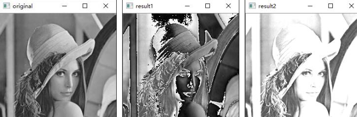
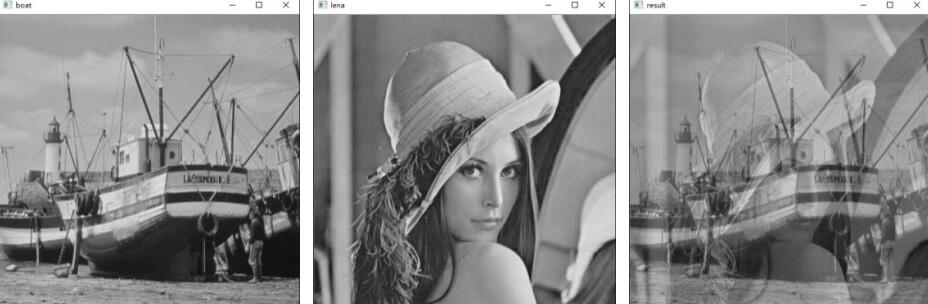
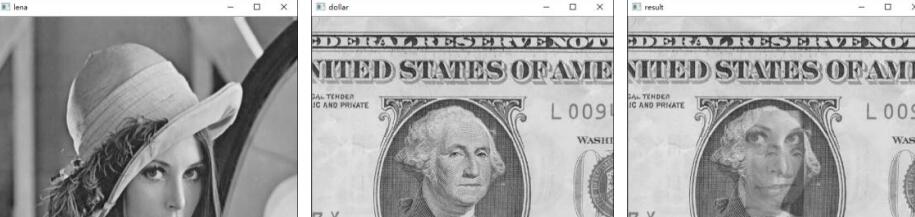

# 3 图像运算

> 针对图像的加法运算、位运算都是比较基础的运算。但是，很多复杂的图像处理功能正是借助这些基础的运算来完成的。所以，牢固掌握基础操作，对于更好地实现图像处理是非常有帮助的。
>
> 本章简单介绍了加法运算、位运算，并使用它们实现了位平面分解、图像异或加密、数字水印、脸部打码/解码等实例。

# 3.1 图像加法运算

两种方式

- 加号运算符
- cv2.add()函数

## 3.1.1 加号运算符

加法规则:
$$
a+b=\left\{\begin{matrix}
  a+b& a+b\le255\\
mod(a+b,256)  &a+b\gt255
\end{matrix}\right.
$$

```python
"""
【例 3.1】使用随机数数组模拟灰度图像，观察使用“+”对像素值求和的结果
"""
import numpy as np
# 通过将数组的数值类型定义为 dtype=np.uint8，可以保证数组值的范围在[0,255]之间。
img1 = np.random.randint(0, 256, size=[3, 3], dtype=np.uint8)
img2 = np.random.randint(0, 256, size=[3, 3], dtype=np.uint8)
print("img1=\n", img1)
print("img2=\n", img2)
print("img1+img2=\n", img1+img2)
```

```bash
img1=
 [[134 147 124]
 [ 33  88 194] 
 [235 197 197]]
img2=
 [[211 207  72]
 [154 146 148] 
 [217  62 146]]
img1+img2=     
 [[ 89  98 196]
 [187 234  86] 
 [196   3  87]]
```

## 3.1.2 cv2.add()函数

函数 cv2.add()可以用来计算图像像素值相加的和，其语法格式为：

`计算结果=cv2.add(像素值 a,像素值 b)`
$$
a+b=\left\{\begin{matrix}
  a+b& a+b\le255\\
 255  &a+b\gt255
\end{matrix}\right.
$$

```python
"""
【例 3.2】使用随机数组模拟灰度图像，观察函数 cv2.add()对像素值求和的结果。
"""
import numpy as np
import cv2
img1 = np.random.randint(0, 256, size=[3, 3], dtype=np.uint8)
img2 = np.random.randint(0, 256, size=[3, 3], dtype=np.uint8)
print("img1=\n", img1)
print("img2=\n", img2)
img3 = cv2.add(img1, img2)
print("cv2.add(img1,img2)=\n", img3)

```

```bash
img1=
 [[ 26  22  76]    
 [213 200  71]     
 [ 69  73  54]]    
img2=
 [[151 178 220]    
 [ 59 158  25]     
 [144 150 237]]    
cv2.add(img1,img2)=
 [[177 200 255]    
 [255 255  96]     
 [213 223 255]]
```

```python
"""
【例 3.3】分别使用加号运算符和函数 cv2.add()计算两幅灰度图像的像素值之和，观察处理
结果。"""
from unittest import result
import cv2
a = cv2.imread("lena.bmp", 0)
b = a
result1 = a+b
result2 = cv2.add(a, b)
cv2.imshow("original", a)
cv2.imshow("result1", result1)
cv2.imshow("result2", result2)
cv2.waitKey()
cv2.destroyAllWindows()
```



🎯取模后大于 255 的这部分值变得更小了，导致本来应该更亮的像素点变得更暗了很明显，而采用cv2.add方式进行相加会使总体的像素值偏大，体现在图像上就更偏白一些。

# 3.2 图像加权和

所谓图像加权和，就是在计算两幅图像的像素值之和时，将每幅图像的权重考虑进来，可以用公式表示为：`dst = saturate(src1 × 𝛼 + src2 × 𝛽 + 𝛾)`

式中，saturate()表示取饱和值（最大值）。图像进行加权和计算时，要求src1 和 src2 必须大小、类型相同，但是对具体是什么类型和通道没有特殊限制。它们可以是任意数据类型，也可以有任意数量的通道（灰度图像或者彩色图像），只要二者相同即可。

OpenCV 中提供了函数 cv2.addWeighted()，用来实现图像的加权和（混合、融合）:

`dst=cv2.addWeighted(src1, alpha, src2, beta, gamma)`

alpha和beta的和可以为1，也可以不为1，gamma为必选参数，可以是0。

式子的理解：`结果图像=图像 1×系数 1+图像 2×系数 2+亮度调节量”。`

```python
"""
【例 3.4】使用数组演示函数 cv2.addWeighted()的使用。
"""
import cv2
import numpy as np
img1 = np.ones((3, 4), dtype=np.uint8)*100
img2 = np.ones((3, 4), dtype=np.uint8)*10
gamma = 3
img3 = cv2.addWeighted(img1, 0.6, img2, 5, gamma)
print(img3)
```

```bash
[[113 113 113 113] 
 [113 113 113 113] 
 [113 113 113 113]]
```

```python
"""
【例 3.5】使用函数 cv2.addWeighted()对两幅图像进行加权混合，观察处理结果。
"""
import cv2
a = cv2.imread("boat.bmp")
b = cv2.imread("lena.bmp")
result = cv2.addWeighted(a, 0.6, b, 0.4, 0)
cv2.imshow("boat", a)
cv2.imshow("lena", b)
cv2.imshow("result", result)
cv2.waitKey()
cv2.destroyAllWindows()
```



```python
"""
【例 3.6】使用函数 cv2.addWeighted()将一幅图像的 ROI 混合在另外一幅图像内。
"""
import cv2
lena = cv2.imread("lena512.bmp", cv2.IMREAD_UNCHANGED)
dollar = cv2.imread("dollar.bmp", cv2.IMREAD_UNCHANGED)
cv2.imshow("lena", lena)
cv2.imshow("dollar", dollar)
face1 = lena[220:400, 250:350]
face2 = dollar[160:340, 200:300]
add = cv2.addWeighted(face1, 0.6, face2, 0.4, 0)
dollar[160:340, 200:300] = add
cv2.imshow("result", dollar)
cv2.waitKey()
cv2.destroyAllWindows()
```



- 左图是原始图像 lena。 

- 中间的图是原始图像 dollar。 

- 右图是图像 lena 的面部与图像 dollar 的面部加权混合得到的图像。

# 3.3 按位逻辑运算

> 逻辑运算是一种非常重要的运算方式，图像处理过程中经常要按照位进行逻辑运算，本节介绍 OpenCV 中的按位逻辑运算，简称位运算。

- cv2.bitwise_and() 	按位与

- cv2.bitwise_or()        按位或

- cv2.bitwise_xor()      按位异或
- cv2.bitwise_not()      按位取反


