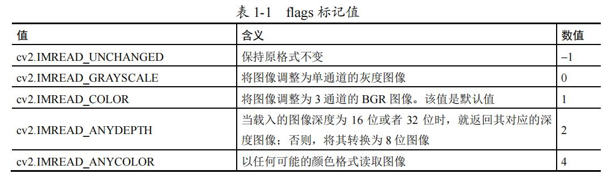
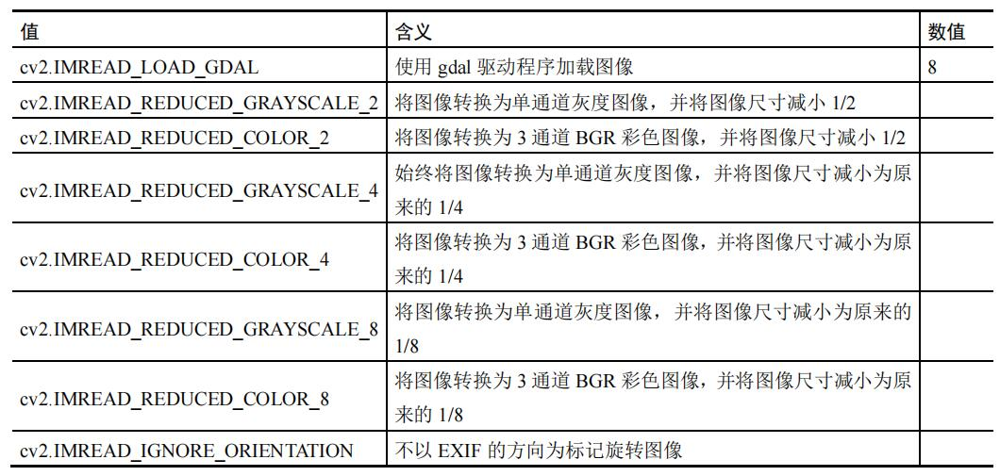

# 《OpenCV轻松入门》笔记-1 OpenCV 入门

# 1 OpenCV 入门

# **OpenCV介绍**

OpenCV 是一个开源的计算机视觉库。
OpenCV 库由 C 和 C++语言编写，涵盖计算机视觉各个领域内的 500 多个函数，可以在多种操作系统上运行。它旨在提供一个简洁而又高效的接口，从而帮助开发人员快速地构建视觉应用。

# **OpenCV下载**

1. 配置python环境
2. 下载OpenCV
   * opencv-contrib-python              4.5.2.54
   * opencv-python                      4.5.2.54

# OpenCV的基本操作

## 读取图像

```Python
cv2.imread()
```





## 展示图像

```Python
cv2.imshow()
```

## 保存图像

```Python
cv2.imwrite()
```

# OpenCV库

* OpenCV主库
* OpenCV贡献库
