# 2 图像处理基础

> 本章主要介绍图像的基本表示方法、像素的访问和操作、感兴趣区域处理、通道处理等知识点。需要强调的是，使用面向 Python 的 OpenCV（OpenCV for Python）必须熟练掌握 Numpy库，尤其是 Numpy.array 库，Numpy.array 库是 Python 处理图像的基础。

# 图像的基本表示方法

## 二值图像

> 二值图像是指仅仅包含黑色和白色两种颜色的图像。
>  
> 使用0，1来表示图像中的像素点，0(黑)，1(白)。

## 灰度图像

> 计算机会将灰度处理为 256 个灰度级，用数值区间[0, 255]来表示。
>  
> 使用0-255之间的数来对应图像中的由黑到白。

## 彩色图像

> 自然界中常见的各种色光都可以通过将三基色按照一定的比例混合构成。从光学角度出发，可以将颜色解析为主波长、纯度、明度等。从心理学和视觉角度出发，可以将颜色解析为色调、饱和度、亮度等。
>
> RGB三通道，每一个通道都是一个灰度图像。

# 像素处理

> 像素是图像构成的基本单位，像素处理是图像处理的基本操作，可以通过位置索引的形式对图像内的元素进行访问、处理。

## 二值图像及灰度图像

```Python
"""
【例 2.1】使用 Numpy 库生成一个元素值都是 0 的二维数组，用来模拟一幅黑色图像，并
对其进行访问、修改。
"""
import cv2
import numpy as np

img = np.zeros((8, 8), dtype=np.uint8)
print("img=\n", img)  # 8*8的零矩阵
print('读取像素点=', img[0, 3])
cv2.imshow("one", img)  # 展示图像黑色的小矩形
img[0, 3] = 255
print("img=\n", img)  # 8*8的零矩阵
print('读取像素点=', img[0, 3])
cv2.imshow("two", img)  # 展示图像-带有白点的黑色的小矩形
cv2.waitKey()
cv2.destroyAllWindows()

```

```Python
"""
【例 2.2】读取一个灰度图像，并对其像素进行访问、修改。
"""
import cv2
img = cv2.imread("lena.bmp", 0)  # 将图像调整为单通道的灰度图像 
cv2.imshow("before", img)
# 原图像中会出现白色的矩形块
for i in range(10, 100):
    for j in range(80, 100):
        img[i, j] = 255
cv2.imshow("after", img)
cv2.waitKey()
cv2.destroyAllWindows()

```

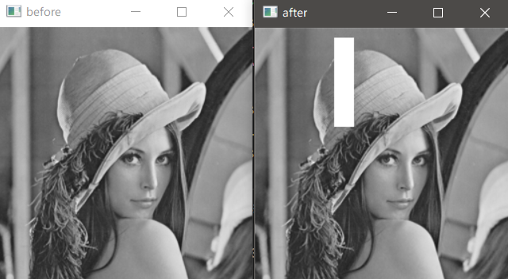  

## 彩色图像

img[i, j, c]的理解
* i：第i行
* j：第j列
* c：c通道(BGR)

```Python
"""
【例 2.3】使用 Numpy 生成三维数组，用来观察三个通道值的变化情况。
"""

import numpy as np
import cv2
# -----------蓝色通道值--------------
blue = np.zeros((300, 300, 3), dtype=np.uint8)
print("blue=\n", blue)
blue[:, :, 0] = 255  # B通道
print("blue=\n", blue)
cv2.imshow("blue", blue)
# -----------绿色通道值--------------
green = np.zeros((300, 300, 3), dtype=np.uint8)
green[:, :, 1] = 255
print("green=\n", green)
cv2.imshow("green", green)
# -----------红色通道值--------------
red = np.zeros((300, 300, 3), dtype=np.uint8)
red[:, :, 2] = 255
print("red=\n", red)
cv2.imshow("red", red)
cv2.waitKey()
cv2.destroyAllWindows()
cv2.waitKey()
cv2.destroyAllWindows()

```

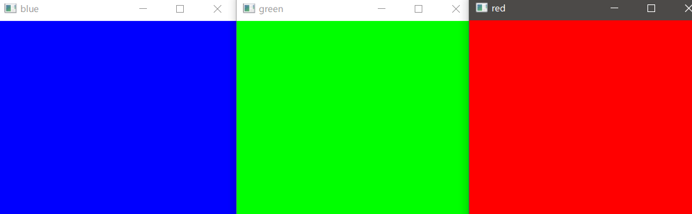  
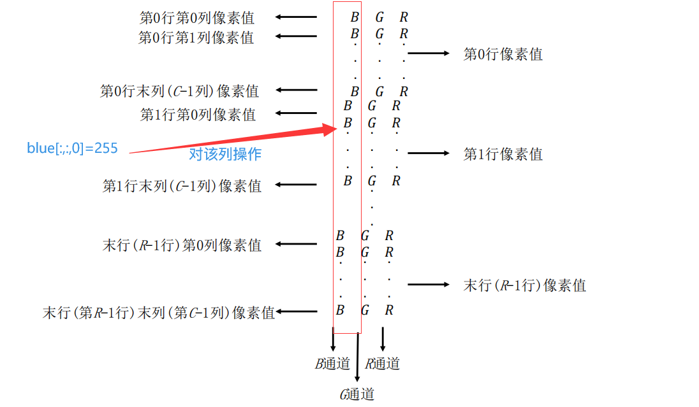  

```Python
"""
【例 2.4】使用 Numpy 生成一个三维数组，用来观察三个通道值的变化情况。
"""
import numpy as np
import cv2

img = np.zeros((300, 300, 3), np.uint8)
img[:, 0:100, 0] = 255
img[:, 100:200, 1] = 255
img[:, 200:300, 2] = 255
print("img=\n", img)
cv2.imshow("img", img)

img2 = np.zeros((300, 300, 3), np.uint8)
img2[0:100, :, 0] = 255
img2[100:200, :, 1] = 255
img2[200:300, :, 2] = 255

print("img=\n", img2)
cv2.imshow("img2", img2)
cv2.waitKey()
cv2.destroyAllWindows()

```

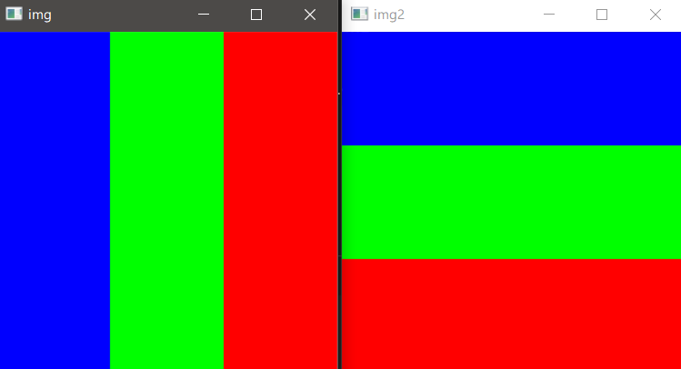  

```python
"""
【例 2.5】使用 Numpy 生成一个三维数组，用来模拟一幅 BGR 模式的彩色图像，并对其进
行访问、修改。
"""
import numpy as np
img = np.zeros((2, 4, 3), dtype=np.uint8)

print(img)
print("img=\n", img)
print("读取像素点img[0,3]=", img[0, 3])
print("读取像素点img[1,2,2]=", img[1, 2, 2])
img[0, 3] = 255
img[0, 0] = [66, 77, 88]
img[1, 1, 1] = 3
img[1, 2, 2] = 4
img[0, 2, 0] = 5
print(img)
```

🎯补充：理解张量和图像的关系？

> 目前所处理的图像矩阵其实就是三阶张量的形式。三个轴分别是高度、宽度、通道。

为方便理解，可以做一个测试，假如给一个形式为(200,400,3)的全零张量，根据图像知识，我们可以知道它对应一个高200宽400的黑矩形，我想要给这个矩形中间挖空一部分，如何实现呢？

```python
import cv2
import numpy as np
img = np.zeros((200, 400, 3), dtype=np.uint8)
img1 = np.zeros((200, 400, 3), dtype=np.uint8)
# 中间挖空，第一个维度设置高度，第二个维度设置宽带，第三维度控制通道
img[50:150, 100:300] = 255 # 不设置通道索引，默认全为255即为白色
cv2.imshow("img1", img)
img1[50:150, 100:300, [1, 2]] = 255 # GR交叉为黄色
cv2.imshow("img2", img1)
cv2.waitKey()
cv2.destroyAllWindows()
```

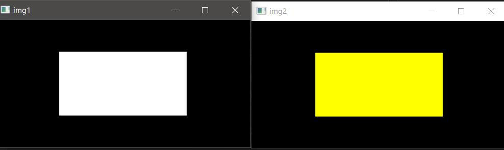

```python
"""
【例 2.6】读取一幅彩色图像，并对其像素进行访问、修改。
(对图像左上角的部分分三块，依次设为白、灰、黑)
"""
import cv2
img = cv2.imread("lenacolor.png")
cv2.imshow("before", img)
print(img.shape)  # (512, 512, 3)
# print("访问img[0,0]=", img[0, 0])
# 区域1
for i in range(0, 50):
    for j in range(0, 100):
        for k in range(0, 3):
            img[i, j, k] = 255  # 白色
# 区域2
for i in range(50, 100):
    for j in range(0, 100):
        img[i, j] = [128, 128, 128]  # 灰色
# 区域3
for i in range(100, 150):
    for j in range(0, 100):
        img[i, j] = 0  # 黑色

cv2.imshow("after", img)
cv2.waitKey()
cv2.destroyAllWindows()
```

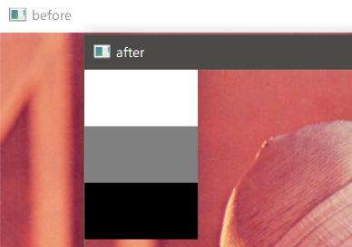

# 使用 numpy.array 访问像素

> numpy.array 提供了 item()和 itemset()函数来访问和修改像素值，而且这两个函数都是经过优化处理的，能够更大幅度地提高处理效率。在访问及修改像素点的值时，利用 numpy.array提供的函数比直接使用索引要快得多，同时，这两个函数的可读性也更好。

## 二值图像及灰度图像

函数 item()能够更加高效地访问图像的像素点：

- item(行,列)

函数 itemset()可以用来修改像素值：

- itemset(索引值,新值)

```python
"""
【例 2.7】使用 Numpy 生成一个二维随机数组，用来模拟一幅灰度图像，并对其像素进行
访问、修改。
"""
import numpy as np
img = np.random.randint(10, 99, size=[5, 5], dtype=np.uint8)
print("img=\n", img)
print(img.item(3, 2))  # 访问
img.itemset((3, 2), 255)  # 修改
print("修改后img=\n", img)
print("修改后像素点img.item(3,2)=", img.item(3, 2))

```

```bash
img=
 [[76 68 92 18 53]
 [33 90 65 81 15]
 [17 75 51 55 96]
 [84 81 18 88 19]
 [47 88 71 88 41]]
18
修改后img=
 [[ 76  68  92  18  53]       
 [ 33  90  65  81  15]        
 [ 17  75  51  55  96]        
 [ 84  81 255  88  19]        
 [ 47  88  71  88  41]]       
修改后像素点img.item(3,2)= 255
```

```python
"""
【例 2.8】生成一个灰度图像，让其中的像素值均为随机数。
"""
import numpy as np
import cv2

img = np.random.randint(0, 256, [512, 512], dtype=np.uint8)
cv2.imshow("img", img)
print(img)
cv2.waitKey()
cv2.destroyAllWindows()
```

```shell
输出一个类似马赛克的灰度图像
```

```python
"""
【例 2.9】读取一幅灰度图像，并对其像素值进行访问、修改。
"""
import cv2
img = cv2.imread("lena.bmp", 0)
# 测试读取、修改单个像素值
print("读取像素点img.item(3,2)=", img.item(3, 2))
img.itemset((3, 2), 255)
print("修改后像素点img.item(3,2)=", img.item(3, 2))
# 测试修改一个区域的像素值
cv2.imshow("before", img)
for i in range(10, 100):
    for j in range(80, 100):
        img.itemset((i, j), 255)
cv2.imshow("after", img)
cv2.waitKey()
cv2.destroyAllWindows()
#读取像素点 img.item(3,2)= 159
#修改后像素点 img.item(3,2)= 255
```

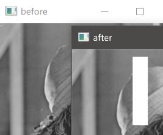

## 彩色图像

⚠需要增加通道值的设置

函数 item()访问 RGB 模式图像的像素值时，其语法格式为：

- item(行,列,通道)

函数 itemset()修改（设置）RGB 模式图像的像素值时，其语法格式为：

- itemset(三元组索引值,新值)

```python
"""
【例 2.10】使用 Numpy 生成一个由随机数构成的三维数组，用来模拟一幅 RGB 色彩空间
的彩色图像，并使用函数 item()和 itemset()来访问和修改它。
"""
import numpy as np
# 由原来的[h,w]=>[h,w,c],c=3
img = np.random.randint(10, 99, size=[2, 4, 3], dtype=np.uint8)
print("img=\n", img)
print("读取像素点img[1,2,0]=", img.item(1, 2, 0))
print("读取像素点img[0,2,1]=", img.item(0, 2, 1))
print("读取像素点img[1,0,2]=", img.item(1, 0, 2))
img.itemset((1, 2, 0), 255)
img.itemset((0, 2, 1), 255)
img.itemset((1, 0, 2), 255)
print("修改后img=\n", img)
print("修改后像素点img[1,2,0]=", img.item(1, 2, 0))
print("修改后像素点img[0,2,1]=", img.item(0, 2, 1))
print("修改后像素点img[1,0,2]=", img.item(1, 0, 2))

```

```shell
img=
 [[[70 92 47]
  [48 15 95]
  [93 96 57]
  [13 19 32]]

 [[84 89 40]
  [79 80 96]
  [11 41 12]
  [28 21 85]]]
读取像素点img[1,2,0]= 11
读取像素点img[0,2,1]= 96
读取像素点img[1,0,2]= 40
修改后img=
 [[[ 70  92  47]        
  [ 48  15  95]
  [ 93 255  57]
  [ 13  19  32]]        

 [[ 84  89 255]
  [ 79  80  96]
  [255  41  12]
  [ 28  21  85]]]
修改后像素点img[1,2,0]= 255
修改后像素点img[0,2,1]= 255
修改后像素点img[1,0,2]= 255
```

```python
"""
【例 2.11】生成一幅彩色图像，让其中的像素值均为随机数。
"""
import cv2
import numpy as np
img = np.random.randint(0, 256, size=[256, 256, 3], dtype=np.uint8)
cv2.imshow("demo", img)
cv2.waitKey()
cv2.destroyAllWindows()
```

```bash
输出一张类似于马斯克的彩色图片
```

```python
"""
【例 2.12】读取一幅彩色图像，并对其像素进行访问、修改。
"""
import cv2
img = cv2.imread("lenacolor.png")
cv2.imshow("before", img)
print("访问img.item(0,0,0)=", img.item(0, 0, 0))
print("访问img.item(0,0,1)=", img.item(0, 0, 1))
print("访问img.item(0,0,2)=", img.item(0, 0, 2))
for i in range(0, 50):
    for j in range(0, 100):
        for k in range(0, 3):
            img.itemset((i, j, k), 255)  # 白色
cv2.imshow("after", img)
print("修改后img.item(0,0,0)=", img.item(0, 0, 0))
print("修改后img.item(0,0,1)=", img.item(0, 0, 1))
print("修改后img.item(0,0,2)=", img.item(0, 0, 2))
cv2.waitKey()
cv2.destroyAllWindows()

```

```bash
类比例2.6，仅仅是对像素的操作方式
```


# 感兴趣区域（ROI）

什么是ROI?

> 在图像处理过程中，我们可能会对图像的某一个特定区域感兴趣，该区域被称为感兴趣区域（Region of Interest，ROI）。

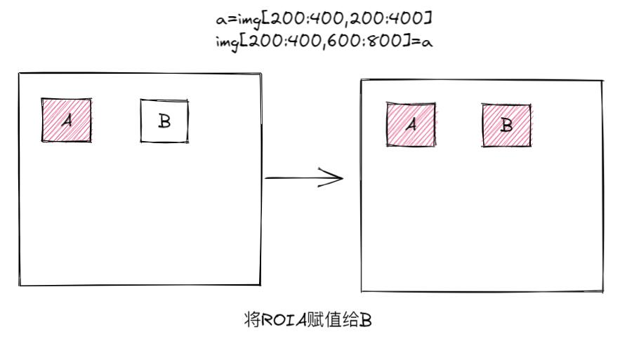

```python
"""
【例 2.13】获取图像 lena 的脸部信息，并将其显示出来
"""
import cv2
a = cv2.imread("lenacolor.png", cv2.IMREAD_UNCHANGED)  # 原格式读取
face = a[220:400, 250:350]
cv2.imshow("original", a)
cv2.imshow("face", face)
cv2.waitKey()
cv2.destroyAllWindows()

```

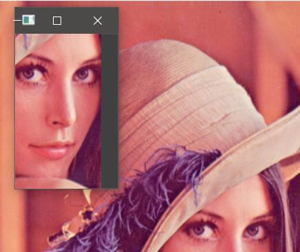

```python
"""
【例 2.14】对 lena 图像的脸部进行打码。
"""
import cv2
import numpy as np
a = cv2.imread("lenacolor.png", cv2.IMREAD_UNCHANGED)
cv2.imshow("original", a)
face = np.random.randint(0, 256, (180, 100, 3))
a[220:400, 250:350] = face
cv2.imshow("result", a)
cv2.waitKey()
cv2.destroyAllWindows()

```

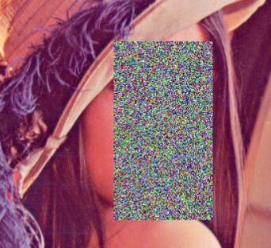

```python
"""
【例 2.15】将一幅图像内的 ROI 复制到另一幅图像内。
"""
import cv2
lena = cv2.imread("lena512.bmp", cv2.IMREAD_UNCHANGED)
dollar = cv2.imread("dollar.bmp", cv2.IMREAD_UNCHANGED)
cv2.imshow("lena", lena)
cv2.imshow("dollar", dollar)
face = lena[220:400, 250:350]
dollar[160:340, 200:300] = face
cv2.imshow("result", dollar)
cv2.waitKey()
cv2.destroyAllWindows()

```


# 通道操作

> RGB 图像中，图像是由 R 通道、G 通道、B 通道三个通道构成的。
>
> ⚠需要注意的是，在OpenCV 中，通道是按照 B 通道→G 通道→R 通道的顺序存储的。
>
> 在图像处理过程中，可以根据需要对通道进行拆分和合并。

## 通道拆分

> 针对 RGB 图像，可以分别拆分出其 R 通道、G 通道、B 通道。

### 通过索引拆分

分别提取BGR通道

- b = img[ : , : , 0 ]

- g = img[ : , : , 1 ]

- r = img[ : , : , 2 ]

```python
"""
【例 2.16】编写程序，演示图像通道拆分及通道值改变对彩色图像的影响。
"""
import cv2
lena=cv2.imread("lenacolor.png")
cv2.imshow("lena1",lena)
b=lena[:,:,0]
g=lena[:,:,1]
r=lena[:,:,2]
cv2.imshow("b",b)
cv2.imshow("g",g)
cv2.imshow("r",r)
lena[:,:,0]=0
cv2.imshow("lenab0",lena)
lena[:,:,1]=0
cv2.imshow("lenab0g0",lena)
cv2.waitKey()
cv2.destroyAllWindows()

```

```bash
图(a)是原始图像 lena。 
图(b)是原始图像 lena 的 B 通道图像 b。 
图(c)是原始图像 lena 的 G 通道图像 g。 
图(d)是原始图像 lena 的 R 通道图像 r。 
图(e)是将图像 lena 中 B 通道值置为 0 后得到的图像。
图(f)是将图像 lena 中 B 通道值、G 通道值均置为 0 后得到的图像。
```

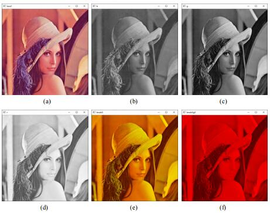

### 通过函数拆分

`b,g,r=cv2.split(img)`

上述语句与如下语句是等价的：

- `b=cv2.split(a)[0]`

- `g=cv2.split(a)[1]`

- `r=cv2.split(a)[2]`

```python
"""
【例 2.17】编写程序，使用函数 cv2.split()拆分图像通道。
"""
import cv2
lena = cv2.imread("lenacolor.png")
b, g, r = cv2.split(lena)
cv2.imshow("B", b)
cv2.imshow("G", g)
cv2.imshow("R", r)
cv2.waitKey()
cv2.destroyAllWindows()

```

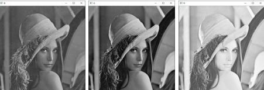

## 通道合并

> 通道合并是通道拆分的逆过程，通过合并通道可以将三个通道的灰度图像构成一幅彩色图像。函数 `cv2.merge()`可以实现图像通道的合并，例如有 B 通道图像 b、G 通道图像 g 和 R 通道图像 r，使用函数 cv2.merge()可以将这三个通道合并为一幅 BGR 的三通道彩色图像。其实现的语句为：`bgr=cv2.merge([b,g,r])`

```python
"""
【例 2.18】编写程序，演示使用函数 cv2.merge()合并通道。
"""
import cv2
lena = cv2.imread("lenacolor.png")
b, g, r = cv2.split(lena)
bgr = cv2.merge([b, g, r])
rgb = cv2.merge([r, g, b])
cv2.imshow("lena", lena)
cv2.imshow("bgr", bgr)
cv2.imshow("rgb", rgb)
cv2.waitKey()
cv2.destroyAllWindows()

```

```bash
左图是原始图像 lena。 
中间的图是 lena 图像经过通道拆分、合并后得到的 BGR 通道顺序的彩色图像 bgr。 
右图是 lena 图像经过通道拆分、合并后得到的 RGB 通道顺序的彩色图像 rgb。
```

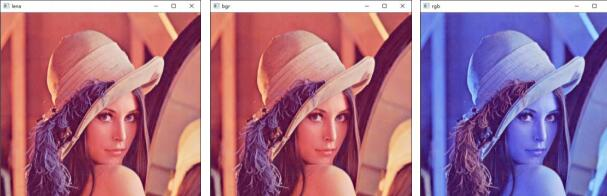

# 获取图像属性

图像处理常用属性：

- shape：
  - 如果是彩色图像，则返回包含行数、列数、通道数的数组；
  - 如果是二值图像或者灰度图像，则仅返回行数和列数。
  - 通过该属性的返回值是否包含通道数，可以判断一幅图像是灰度图像（或二值图像）还是彩色图像。

-  size：返回图像的像素数目。其值为“行×列×通道数”，灰度图像或者二值图像的通道数为 1。 

-  dtype：返回图像的数据类型。

```python
"""
【例 2.19】编写程序，观察图像的常用属性值。
"""
import cv2
gray = cv2.imread("lena.bmp", 0)
color = cv2.imread("lenacolor.png")
print("图像gray属性：")
print("gray.shape=", gray.shape)
print("gray.size=", gray.size)
print("gray.dtype=", gray.dtype)
print("图像color属性：")
print("color.shape=", color.shape)
print("color.size=", color.size)
print("color.dtype=", color.dtype)
```

```bash
图像gray属性：
gray.shape= (256, 256)    
gray.size= 65536
gray.dtype= uint8
图像color属性：
color.shape= (512, 512, 3)
color.size= 786432        
color.dtype= uint8  
```